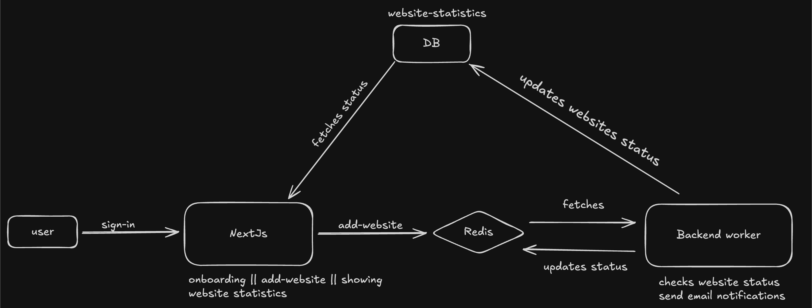

# 🛠️ **Uptime Worker Backend**

> ⚠️ **Note:**  
> This is the **backend server** responsible for checking the **uptime** of user-registered websites in the main [Uptime Monitoring](https://github.com/chaharhimanshu1004/uptime-monitoring) app.

---

## 🧠 Overview

The **Uptime Worker Backend** runs independently to continuously monitor the availability of websites registered by users through the main frontend application.

It performs the following tasks:

- Periodically pings websites to check their availability.
- Detects downtime or failures.
- Sends notifications and updates to the primary app.

This architecture ensures a **decoupled, scalable**, and **resilient** uptime monitoring system.

You can find the Main uptime monitoring repo here:  
[https://github.com/chaharhimanshu1004/uptime-monitoring](https://github.com/chaharhimanshu1004/uptime-monitoring)
---

## ⚙️ Tech Stack

- **Node.js**
- **Redis** (for task queueing and scheduling)
- **Axios / HTTP modules** for pinging websites
- **Nodemailer** for notifications (optional or configurable)
- **dotenv** for environment variable management

---

## 🏗️ Architecture


## 📦 Setup Instructions

1. **Clone the Repository:**

```bash
git clone https://github.com/chaharhimanshu1004/uptime-worker-backend.git
cd uptime-worker-backend
